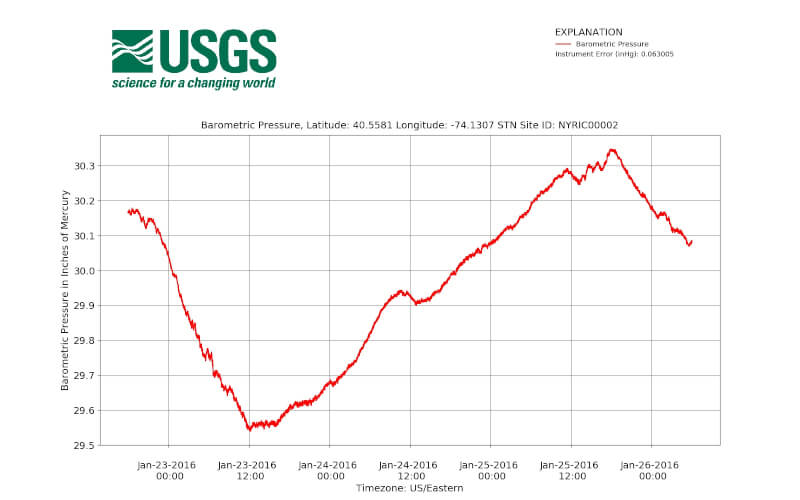
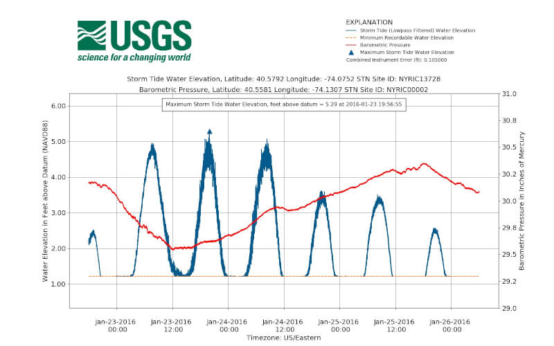
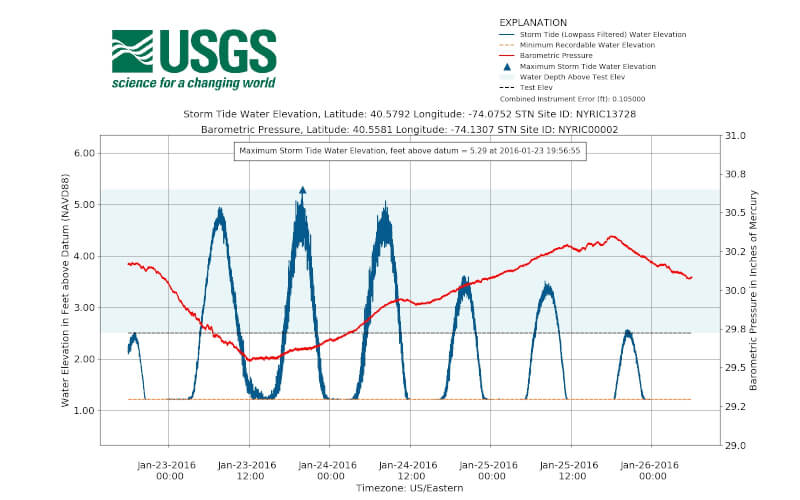
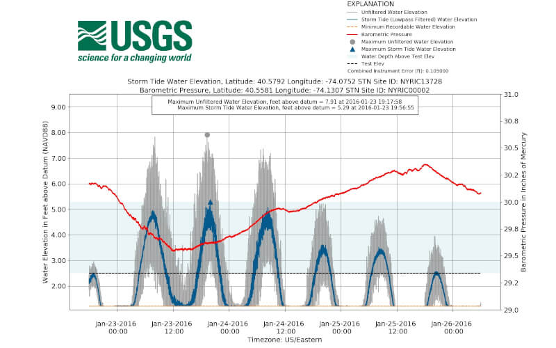
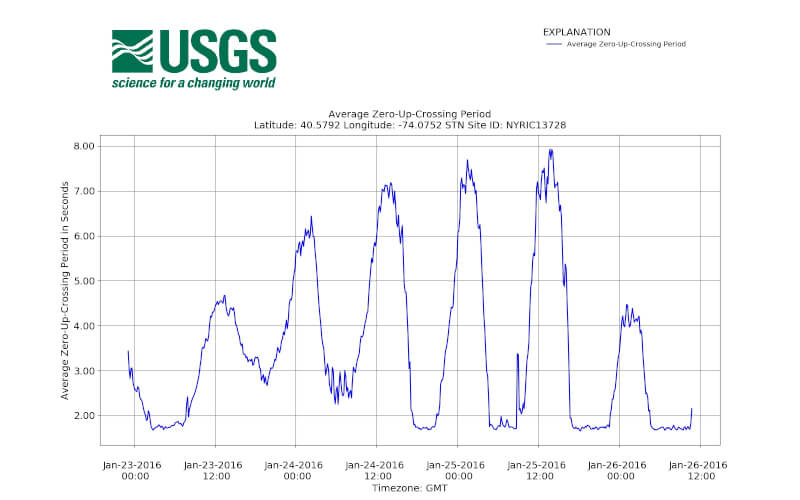

## Storm GUI Output

The following is breakdown of output files that can be output from Storm GUI after processing. They are grouped by file type.

### netCDF Files

<table class="cust-table">
    <tr><th style="width: 150px">Output File</th><th>Output Suffix</th><th>Description</th></tr>
    <tr><td>Storm-Tide Water Level</td><td>*_stormtide.nc</td>
        <td>This file contains three time series: 1)' 
            air pressure 2) sea pressure 3) sea surface elevation. The third was derived
            from a time series of high frequency sea pressure measurements
            adjusted using the former and then lowpass filtered to remove
            waves of period 1 second or less.</td></tr>
    <tr><td>Storm-Tide with Unfiltered Water Level</td><td>*_stormtide_unfiltered.nc</td>
        <td>This file contains four time series: 1) air pressure 2) sea pressure 3) sea surface elevation
                                4) unfiltered sea surface elevation. The third was derived
                                from a time series of high frequency sea pressure measurements
                                adjusted using the former and then lowpass filtered to remove
                                waves of period 1 second or less. The fourth is also sea surface elevation
                                with no such filter.</td></tr>
     <tr><td>Wave Statistics</td><td>*_wave_statistics.nc</td>
        <td>This file contains time, frequency, power spectral density, and wave statistics.
                                For both wave heights and the power spectral density, the 90% confidence intervals
                                were derived.</td></tr>
</table>

For guidance on how to read NetCDF files, please visit the <a href="https://code.usgs.gov/wavelab/wavelab/-/blob/master/documentation/notebooks/netcdf.md">Reading NetCDF Files</a> page.

### Visualizations

<table class="cust-table">
    <tr><th style="width: 150px">Output File</th><th>Output Suffix</th><th>Description</th><th>Image</th></tr>
    <tr><td>Atmospheric Pressure</td><td>*_barometric_pressure.jpg</td>
        <td>Barometric Pressure Visualization</td><td></tr>
    <tr><td>Storm-Tide Water Level</td><td>*_stormtide.jpg</td>
        <td>Storm-Tide Water Level Visualization</td><td></tr>
    <tr><td>(Same as above)</td><td>*_reference_stormtide.jpg</td>
        <td>Storm-Tide Water Level Visualization with Reference Height (if reference height provided)</td><td></tr>
     <tr><td>Storm-Tide with Unfiltered Water Level</td><td>*_stormtide_unfiltered.jpg</td>
        <td>Storm-Tide and Unfiltered Water Level Visualization</td><td></tr>
    <tr><td>(Same as above)</td><td>*_reference_stormtide_unfiltered.jpg</td>
        <td>Storm-Tide and Unfiltered Water Level Visualization with Reference Height (if reference height provided)</td><td></tr>
    <tr><td>Average Z Cross</td><td>*_avg_z_cross.jpg</td>
        <td>Average Zero Up-crossing Period Visualization</td><td></tr>
     <tr><td>H1/3</td><td>*_h13.jpg</td>
        <td>Significant Wave Height Visualization</td><td></tr>
    <tr><td>PSD</td><td>*_psd_contours.jpg</td>
        <td>Contours of Power Spectral Density Visualization</td><td></tr>
    <tr><td>Peak Wave</td><td>*_peak_wave.jpg</td>
        <td>Peak Wave Period Visualization</td><td></tr>
</table>

### CSV Files

<table class="cust-table" style="float:left; width: 100%">
    <tr><th style="width: 150px">Output File</th><th style="width: 150px">Output Suffix</th><th>Description</th></tr>
    <tr><td>Atmospheric Pressure</td><td>*_barometric_pressure.csv</td>
        <td>Contains barometric pressure data.</td></tr>
    <tr><td>PSD (Power Spectral Density)</td><td>*_psd.csv</td>
        <td>Contains power spectral density of the time series.</td></tr>
     <tr><td>Stats (Wave Statistics)</td><td>*_stats.csv</td>
        <td>Contains wave statistics of the time series.</td></tr>
     <tr><td>Storm-Tide Water Level</td><td>*_stormtide.csv</td>
        <td>Contains low-pass filtered water level of the time series.</td></tr>
     <tr><td>Storm-Tide with Unfiltered Water Level</td><td>*_stormtide_unfiltered.csv</td>
        <td>Contains low-pass filtered water level and unfiltered water level of the time series.</td></tr>
</table>
