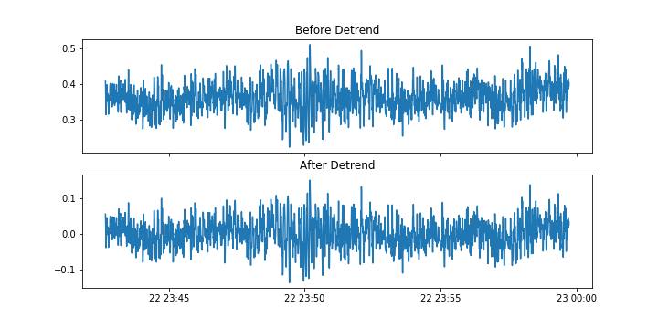
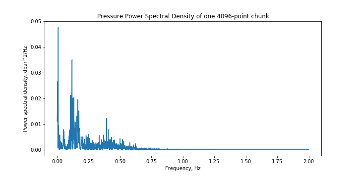
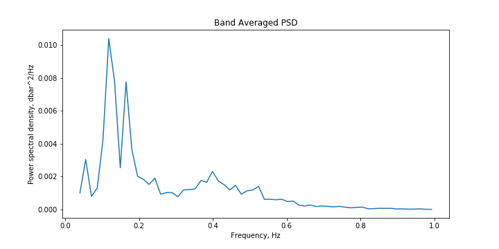
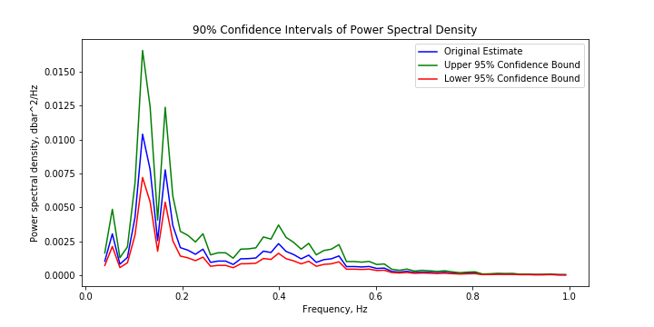
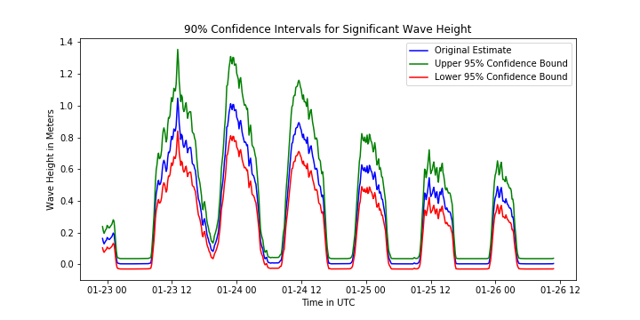
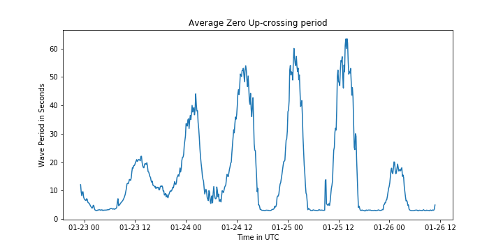

# Wave Statistics

We make the following assumptions when calculating wave statistics:

1. Linear Wave Theory is applicable.
2. Mean water depth and waves are sufficiently constant over each 17 minute time series chunk (4096 points of data collected at 4 Hz) in order to yield meaningful wave statistics.

Split the corrected sea pressure time series into chunks of 4096 points
(approximately 17 minutes of 4 Hz data) with each chunk overlapping the preceding chunk
by 2048 points.


```python
step = 2048
start_index = 0
end_index = 4096
p_chunks = []
t_chunks = []
dt_chunks = []
elev_chunks = []
orifice_chunks = []

while end_index < len(corrected_pressure):
    p_chunks.append(corrected_pressure[start_index:end_index])
    t_chunks.append(corrected_time[start_index:end_index])
    dt_chunks.append(corrected_date_times[start_index:end_index])
    orifice_chunks.append(orifice_elev[start_index:end_index])
    elev_chunks.append(land_elev[start_index:end_index])
    start_index += step
    end_index += step
    
og_pchunks = [x for x in p_chunks]
```

### Calculating Pressure and Water Level Spectra

Remove the linear trend from each pressure time series chunk. The time series
of a single 4096-point chunk with the trend removed is plotted below . We plot the 5th
chunk from the full pressure time series and continue to use this chunk for illustrative
purposes throughout the remainder of this section:


```python
for x in range(0,len(p_chunks)):
    coeff = np.polyfit(t_chunks[x],p_chunks[x],1)
    static_p = coeff[1] + coeff[0]*t_chunks[x]
    p_chunks[x] = p_chunks[x] - static_p
```





Calculate the power spectral density of each pressure chunk:


```python
#parameters are number of samples in segment and sampling time step in seconds
ogfreqs = np.fft.rfftfreq(4096,d=1/4.0)
ogfreqs = ogfreqs[1:]
psd_amps = []
for x in p_chunks:
    fft = (abs(np.fft.rfft(x))**2 / (len(x)/2)) / 4.0
    fft = fft[1:]
    psd_amps.append(fft)
   
psd_amps = np.array(psd_amps)
```





Band average every 16 bands and center them on the average of each band's
frequencies in order to increase the degrees of freedom and narrow the confidence
intervals of the spectral estimates. Then, filter all energy that is greater than 1hz.


```python
new_freqs = []
got_freqs = False
df = 32

psd_avg_amps = []

for x in range(0,len(psd_amps)):
    new_amps = []
    step, index = int(df/2), 0
    
    while index < len(ogfreqs):
        if got_freqs == False:
            new_freqs.append(np.average(ogfreqs[np.arange(index, index+step)]))
        
        new_amps.append(np.average(psd_amps[x][np.arange(index, index+step)]))    
        index += step;
            
    if got_freqs == False:
        got_freqs = True

    psd_avg_amps.append(np.array(new_amps))
        
#Cut off frequency within desired range (1 second to 1 minute)
freqs = np.array(new_freqs)
cutoff = np.where((freqs<=1.0) & (freqs>=0.033333333333))

freqs = freqs[cutoff]
psd_avg_amps = [psd_avg_amps[x][cutoff].real for x in range(0, len(psd_avg_amps))]
```





Compute the 90% confidence intervals of each spectral estimate. The following is
a graph of the preceding spectral estimate with a higher and lower bound of confidence.


```python
import scipy.stats as stats

x_range = [freqs for x in range(0,3)]
df = 32
ci = .9
upper = psd_avg_amps[4]*df/stats.chi2.ppf((1 - ci)/2.0, df)
lower = psd_avg_amps[4]*df/stats.chi2.ppf((1 + ci)/2.0, df)
```





Compute the wavenumber ($`k`$) for each frequency ($`\omega`$) using the dispersion
relation $`ω2 = g ∗ k ∗ tanh(k ∗ h)`$ where h is the mean water depth determined for the
4096-point chunk, then calculate the pressure response function, (Jones &
Monismith, 2007) using the following equation:

$`\Large k_{p}(z) = \frac{cosh(z * k)}{cosh(h * k)}`$ <br /><br />
Where: <br />
$`z`$ = Height of the pressure transducer off the sea floor


```python
#----------------Calculate k_p(z) for the 4096-point chunk data
from wavelab.processing.pressure_to_depth import hydrostatic_method, omega_to_k

instrument_height = [np.abs(np.mean(x) - np.mean(y)) for x,y in zip(elev_chunks, orifice_chunks)]
water_depth = [np.mean(hydrostatic_method(x, "salt")) + y for x,y in zip(og_pchunks, instrument_height)]
k_vals = [omega_to_k(freqs * 2.0 * np.pi, np.repeat(x,len(freqs))) for x in water_depth]
kz_vals = [np.array(np.cosh(i*k)/np.cosh(w*k)) for w,k,i in zip(water_depth,k_vals,instrument_height)]
```

Use $`k_{p}^{2}`$ to change the pressure PSD to a water-level PSD using the following
equation:


$`\Large \eta = \frac{p}{k_{p}^{2}}`$  <b>(Jones & Monismith, 2007)</b><br /><br />
Where: <br />
$`p`$ = Pressure PSD<br />
$`\eta`$ = Water Level PSD


```python
from wavelab.processing.wave_stats import Stats

stats = Stats()
upper_psd, lower_psd = [], []
for x in range(0,len(psd_avg_amps)):
    u, l = stats.psd_confidence_intervals(psd_avg_amps[x],df,.9)
    upper_psd.append(u)
    lower_psd.append(l)
    
upper_psd, lower_psd = np.array(upper_psd), np.array(lower_psd)

wl_amps = [z/kz**2 for z, kz in zip(psd_avg_amps, kz_vals)]
wl_up = [z/kz**2 for z, kz in zip(upper_psd, kz_vals)]
wl_down = [z/kz**2 for z, kz in zip(lower_psd, kz_vals)]
```

### Calculating Wave Statistics

Calculate spectral moments by using the trapezoidal rule to integrate over the
PSD using the following equation (Carter, 1982):

$`\Large m_{n} = \int_{0}^{\inf}f^{n}E(f)df`$<br /><br />
Where: <br />
$`m_{n}`$ = The nth spectral moment

Calculate statistics based on the water level PSD.  The following is a table of some statistics that are computed (Vrabel & Rendon, 2013):

| Statistic | Equation&nbsp;&nbsp;&nbsp;&nbsp;&nbsp;&nbsp;&nbsp;&nbsp;&nbsp;&nbsp;&nbsp;&nbsp;&nbsp;&nbsp; | Explanation |
| ----------------------- | --- | ------------------------ |
| Significant Wave Height (H1/3) | $`4 * \sqrt{m_{0}}`$ | Height of the top one third of waves |
| Top Ten Percent Wave Height (H 10%)) | $`5.091 * \sqrt{m_{0}}`$ | Height of the top ten percent of waves |
| Top One Percent Wave Height (H 1%) | $`6.672 * \sqrt{m_{0}}`$ | Height of the top one percent of waves |
| Average Zero Up-crossing Period | $`\sqrt{\frac{m_{0}}{m_{2}}}`$ | Length of average wave period that crosses the mean sea surface |
| Average Wave Period | $`\frac{m_{0}}{m_{1}}`$ | Length of average wave period |

Quick note:  For confidence intervals around significant wave height, we also need to account for the total level accuracy of the two instruments used to collect the data.  <b>This is not the same as total error bars, the USGS has done through testing at our <a href="https://water.usgs.gov/hif/">Hyrdrologic Instrumentation Facility</a> but more in depth testing is necessary to release total error bars for our instruments.</b>


```python
# Calculate Significant Wave Height and Average Zero Up-crossing Period
h13, tavg, h13_up, h13_down = [], [], [], []

# Account for confidence intervals computed earlier as well as combined level accuracy of both deployed instruments
for x in range(0,len(wl_amps)):
    h13.append(4 * np.sqrt(Stats.moment(freqs,wl_amps[x],0)))
    h13_up.append(4 * np.sqrt(Stats.moment(freqs,wl_up[x],0)) + instrument_level_accuracy)
    h13_down.append(4 * np.sqrt(Stats.moment(freqs,wl_down[x],0)) - instrument_level_accuracy)
    tavg.append(Stats.moment(freqs,wl_amps[x],0)/Stats.moment(freqs,wl_amps[x],2))
   
final_times = []
for x in range(0,len(t_chunks)):
    final_times.append(np.mean(t_chunks[x]))
```

### Example Visualizations

The following is a graph of significant wave height:





The following is a graph of the average zero up crossing period:





### References

Carter D. J. T. (1982). Prediction of Wave Height and Period For a Constant Wind Velocity Using <br />
&nbsp;&nbsp;the Jonswap Results. Pergamon Press Ltd., 9 No.1, 17-33. doi:0029-8018/010017-17
    
Earle, Marshall D. (1996). Nondirectional and Directional Wave Data Analysis Procedures. National <br />
&nbsp;&nbsp;Data Buoy Center.

Emery, William J. and Richard E. Thomson (2014), Data Analysis Methods in Physical Oceanography.

Jones, N. and S. Monismith. (2007). Measuring Short Period Wind Waves in a Tidally Forced <br />
&nbsp;&nbsp;Environment with a Subsurface Pressure Gauge. Limnology and Oceanography: Methods, 5, 317-327.

SciPy (0.17.1) [Software]. (2016). SciPy, scipy.signal.welch, 1. http://www.scipy.org
    
Smith J. M. (2002). "Wave Pressure Gauge Analysis with Current". Journal of Waterway, Port, <br />
&nbsp;&nbsp;Coastal, and Ocean Engineering, Novemeber/Decemeber 2002, 271-275. <br />
&nbsp;&nbsp;doi:10.10161/(ASCE)0733-950X(2002)128:6(271)
        
Vrabel, J. and S. Rendon. (2013). Storm Surge, Unpublished Software Routine. United States <br />
&nbsp;&nbsp;Geological Survey, personal communication.


```python

```
